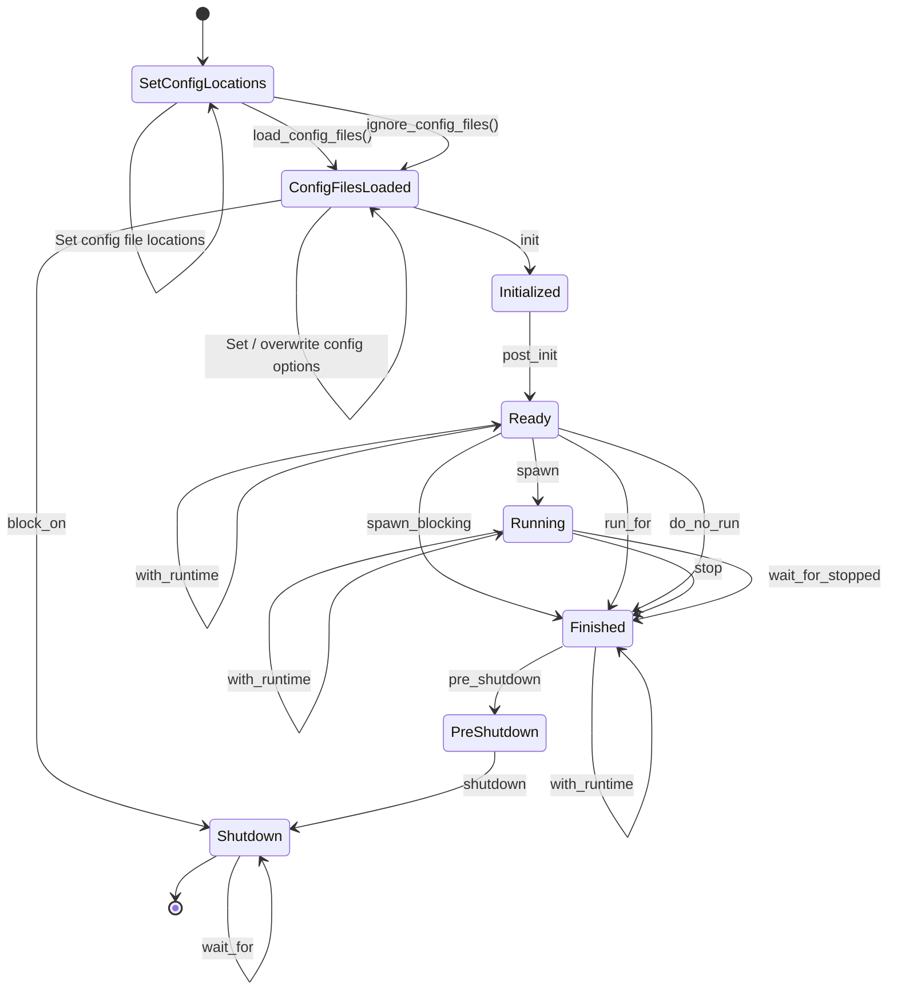

# Runtime Builder

The `RuntimeBuilder` is a builder for `reactive_graph_runtime_api`.

> [!TIP]
> Read about the use cases of the RuntimeBuilder in [System Architecture](./System_Architecture.md#use-cases).

## States

The `RuntimeBuilder` is stateful:

### SetConfigLocations

In this state it is possible to configure the locations of the config files or to skip loading config files at all.

#### Methods

* `instance_config(path)` sets the location of the instance configuration
* `graphql_server_config(path)` sets the location of the graphql server configuration
* `plugins_config(path)` sets the location of the plugins configuration

#### Transitions

* Transition `load_config_files` loads the config files and transits to state `ConfigFilesLoaded`. This is used
  in the executable.
* Transition `ignore_config_files` doesn't load the config files and transits to state `ConfigFilesLoaded`. This is
  useful for integration tests and hard coded initialization.

### ConfigFilesLoaded

In this state either the defaults are set or the the config files are loaded. The `RuntimeBuilder` can
be used to overwrite configurations or defaults.

#### Methods

* `instance_name()` sets the name of the instance.
* `instance_description()` sets the description of the instance.
* `hostname()` sets the hostname of the [GraphQL server](/Configuration_HTTP_GraphQL_Server.md).
* `port()` sets the port number of the GraphQL server
* `pick_free_port()` picks a free port instead of a fixed port number. This is useful for integration tests or
  temporary applications
* `secure()` sets if the GraphQL server shall use https or http
* `shutdown_timeout()` sets timeout of the shutdown of the GraphQL server
* `workers()` sets the number of workers of the GraphQL server
* `default_context_path()` sets context path of a web resource provider which shall be used as default context path
* `disable_all_plugins()` disables all plugins. This is useful for integration tests.
* `disabled_plugins()` sets which plugins will be disabled
* `disable_hot_deploy()` disables hot deployment of plugins
* `hot_deploy_location()` sets the directory where plugins can be hot deployed
* `install_location()` sets the directory where plugins are located. During hot deployment new plugins
  will be moved into this directory.

#### Transitions

* Transition `init` calls the `init` method of the runtime which will run the initialization phase of the services.
  Transits to state `Initialized`.
* Transition `block_on` initializes, runs and shutdowns the `Runtime`. After shutdown transits to state `Shutdown`.

### Initialized

In this state the `Runtime` has been initialized with the `init` method. The next step is to run the `post_init` method.

#### Transitions

* Transition `post_init` calls the `post_init` method

### Ready

In this state the `Runtime` has been fully initialized with the `post_init` method. The `Runtime` is now ready to be
started.

#### Methods

* `get` to get the `Runtime` and leave the builder
* `with_runtime` executes a closure which can operate with the runtime. Stays in state `Ready`.

#### Transitions

* Transition `spawn` spawns a new green thread in which the GraphQL server will be run. This operation is
  **non-blocking** and results in a state transition to the `Running` state.
* Transition `spawn_blocking` calls the `run` method of the runtime which starts the GraphQL server. This
  operation is **blocking** and results in a state transition to the `Finshed` state after the GraphQL
  server has been stopped.
* Transition `run_for` starts the GraphQL server and spawns a new green thread that shuts down the GraphQL server
  after a given duration. The operation is **blocking** and results in a state transition to the `Finshed` state
  after the GraphQL server has been stopped by the timeout.
* Transition `do_not_run` does not start a GraphQL server and transits to the state `Finshed`. This is useful for
  integration tests in combination with `with_runtime`.

### Running

In this state the GraphQL server of the `Runtime` is running.

#### Methods

* `get` to get the `Runtime` and leave the builder
* `with_runtime` executes a closure which can operate with the runtime. Stays in state `Running`.

#### Transitions

* `stop` stops the runtime. It waits for the GraphQL server to be stopped. This operation is **blocking** until
  the GraphQL server has been shutdown gracefully and results in a transition to state `Finished`.
* `stop_with_timeout` is like `stop` but with a timeout. In contrast to `stop`, it is NOT guaranteed that the GraphQL
  server has been stopped actually.
* `wait_for_stopped` waits until the GraphQL server has been stopped. This can happen by using the `ShutdownManager`
  or by sending SIGINT signal to the process. This operation is **blocking** and results in a transition to
  state `Finished`.
* `wait_for_stopped_with_timeout` is like `wait_for_stopped` but with a timeout. In contrast to `stop`, it is NOT
  guaranteed that the GraphQL server has been stopped actually.

### Finished

In this state the GraphQL server of the `Runtime` is no more running (or has never been started). The services
of the runtime are up und running.

#### Methods

* `get` to get the `Runtime` and leave the builder
* `with_runtime` executes a closure which can operate with the runtime. Stays in state `Finished`.

#### Transitions

* Transition `pre_shutdown` calls the `pre_shutdown` method of the `Runtime` and transits to state `PreShutdown`.

### PreShutdown

In this state the services of the `Runtime` has executed their pre_shutdown methods. The next step is to
call the shutdown method.

#### Transitions

* Transition `shutdown` calls the `shutdown` method of the `Runtime` and transits to state `Shutdown`.

### Shutdown

In this state the services of the `Runtime` has executed their shutdown methods. This is the end of the lifetime of a
`Runtime`.

#### Methods

* `wait_for` to wait for a given duration
