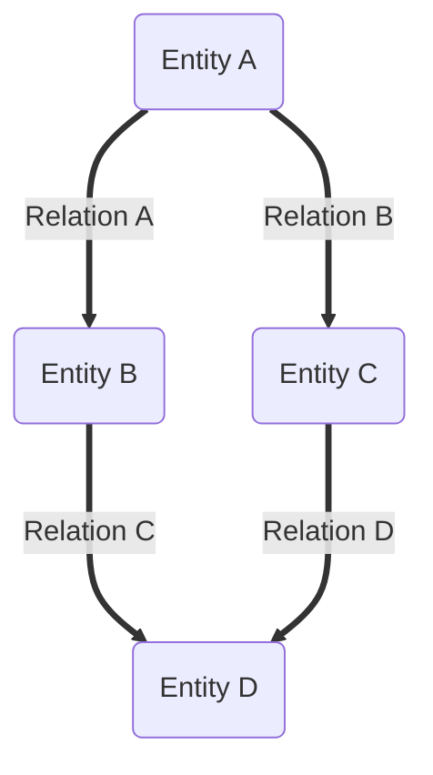
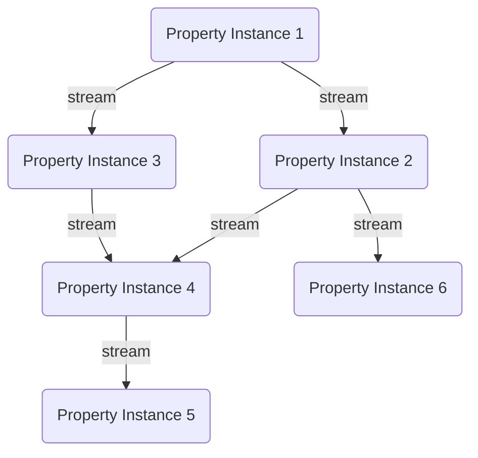
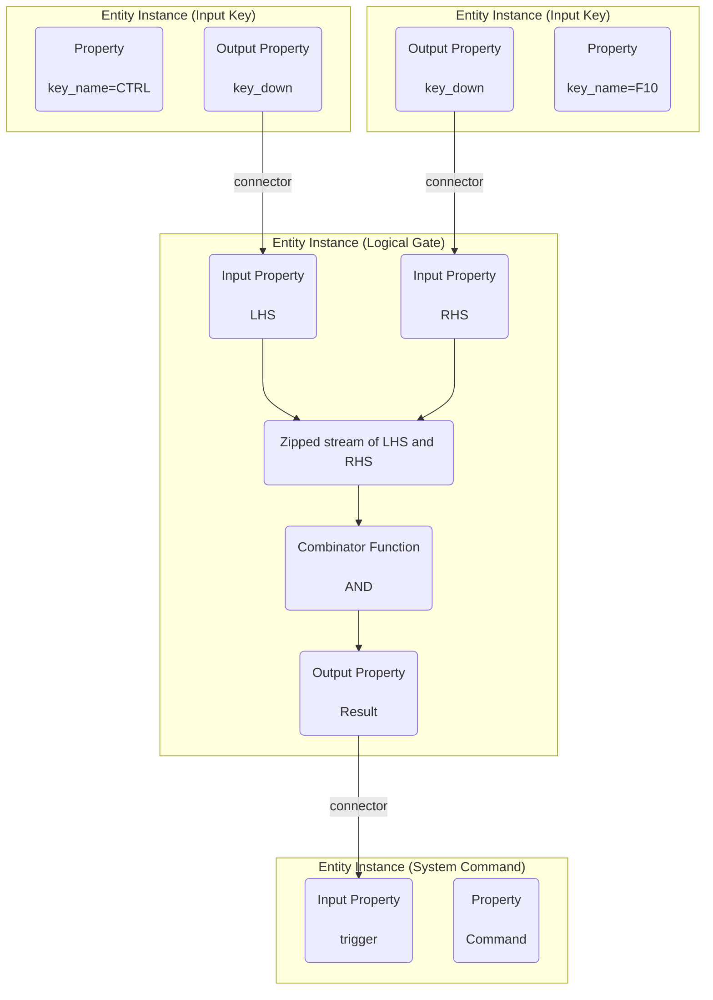
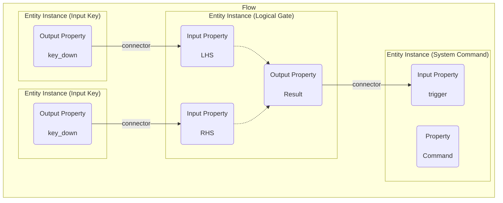

# About `Reactive Graph`

## What is Inexor?

* Inexor will be a new first-person shooter game which is based on a new octree-based game engine.
* Inexor focuses on classic gameplay as we've seen in Cube2 or the Quake series.
* Inexor will be written from ground up new in C++17 and Rust.
* You can contribute anything you want: code, content, ideas...
* Inexor and all its content is 100% open source!

## Graph

### What is a Graph?

A graph organizes highly interconnected data. The state of an Entity Component System can be ideally represented with
the help of the graph. Inexor is the first game engine to introduce a graph as a basis.

### Why do we need a graph?

The main benefits of a graph are:

* A universal data structure for everything
* Relations are first class citizens
* Benefit from types and instances which makes things intuitive
* Benefit from navigation which is fast and intuitive
* Benefit from the semantics of highly connected, intuitive data
* Properties can store not only certain primitive data but complete documents

### What type of graph does Inexor implement?

Internally, Inexor is an in-memory graph database with the following characteristics:

| Characteristics | Description                                                                                                                  |
|-----------------|------------------------------------------------------------------------------------------------------------------------------|
| Directed Graph  | Each relation points from one entity to another entity                                                                       |
| Typed Graph     | <ul><li>Node: Each entity instance is of an entity type</li><li>Edge: Each relation instance is of a relation type</li></ul> |
| Property Graph  | <ul><li>Entities have properties</li><li>Relations have properties</li></ul>                                                 | 

In addition, Inexor takes up concepts from entity component systems. Types, i.e. entity types and relation types, are
assembled using components. The type system itself is flat and supports composition rather than inheritance. Components
can be added or removed from instances, i.e. entity instances or relation instances.

## What is Reactive?

Now that we understand how data is stored, here's how data interacts. The approach is that the data itself is "alive".
To do this, Inexor adopts a concept from reactive programming.

> In computing, reactive programming is a declarative programming paradigm concerned with data streams and the propagation of change.

It is the ingenious combination of a graph with reactive programming. The property instances are not static and only
contain data. Rather, they are streams of data. If you change the value of a property instance, you fill the data
stream of this property instance. Data streams are linked together. For example, if the stream of one property instance
is linked to the stream of another property instance and you change the value of the first property instance, the value
of the second property instance will automatically change as well. Data is thus propagated from one station to the next,
triggering a cascade of propagations. 

In addition, Inexor remembers the last value in each property instance. This is done by subscribing to your own data
stream and caching it. This allows subsequent querying of the value of a property instance.

Remember this basic concept:

1. Every property is a stream not only data
2. Property streams can be subscribed and published
3. The streams of two properties can be connected and changes will be propagated (cascade)

### Behaviour driven design

The data flow is therefore automatic. Building on this, Inexor applies the concept of behaviour-driven design. The goal
is to use these data streams to simulate behaviour.

Behaviors can be implemented on components, entities and relations. To do this, one or more incoming data streams are
combined, calculations are performed and written to one or more outgoing data streams.

For example, the entity type "AND gate" implements a behavior by subscribing to the two input properties, combining them
into a combination data stream and performing an AND operation on the incoming pairs of values. The result of the AND
operation is itself a data stream and this is linked to the output property.

This example shows how an entity type is wired internally. They are all data streams that are cleverly combined with one
another and thus depict behavior.

It is interesting that this behavior also works for relations. For example, connectors are also implemented behaviors of
streams. It is interesting that connectors connect the data stream from a property instance of the outgoing entity
instance with the data stream from a property instance of the incoming entity instance.

For example the `AND-Gate` accepts inputs at the properties `lhs` and `rhs`. Both streams are
subscribed and zipped. The zipped stream is calculated with a function - in this case the
AND-Operator. This results in another (invisible) stream which is connected with the property
`result`. The entity type `AND-Gate` defines that the properties `lhs`, `rhs` and `result`
have to exist. Furthermore, the socket types are defined: `lhs` and `rhs` are `Input-Socket`s
and `result` is a `Output-Socket`. The behaviour is like the internal wiring of entity
instances and of relation instances. A behaviour can be added to entity instances and removed
from entity/relation instances.

In the Reactive Graph Flow there are `ComponentBehaviour`s, `EntityBehaviours` and
`RelationBehaviours`.

| Type                              | Behaviour                                           |
|-----------------------------------|-----------------------------------------------------|
| Entity Type "and"                 | Entity Behaviour `Logical Gate` with AND-combinator |
| Relation Type "default_connector" | Relation Behaviour `Default Connector`              |

Behaviours are provided by [plugins](./Plugin_System.md).

## What is a flow?

Control flows can be implemented based on the graph, the data streams and the behavior-driven design. It is important
here that the available modules that implement the behavior are linked with connectors.

For example, a flow can consist of a logic that links several AND gates with each other using connectors. Both the AND
gate and the connector are behaviors. But the arrangement of these behaviors within a flow makes them powerful.

Entire game modes can be implemented with the help of flows. Or just parts of it that are used in multiple game modes,
such as a mechanism to pick up, drop, and score flags.

Flows are also useful for making maps more interactive. With the help of flows and behaviors, it can be ensured that a
door opens in a map when you press switch 1 and switch 2. Or you determine the color of your own team's base based on
the current score. Or you control particle emitters, depending on how many players are near the emitter. The
possibilities for this are endless and want to be used!

