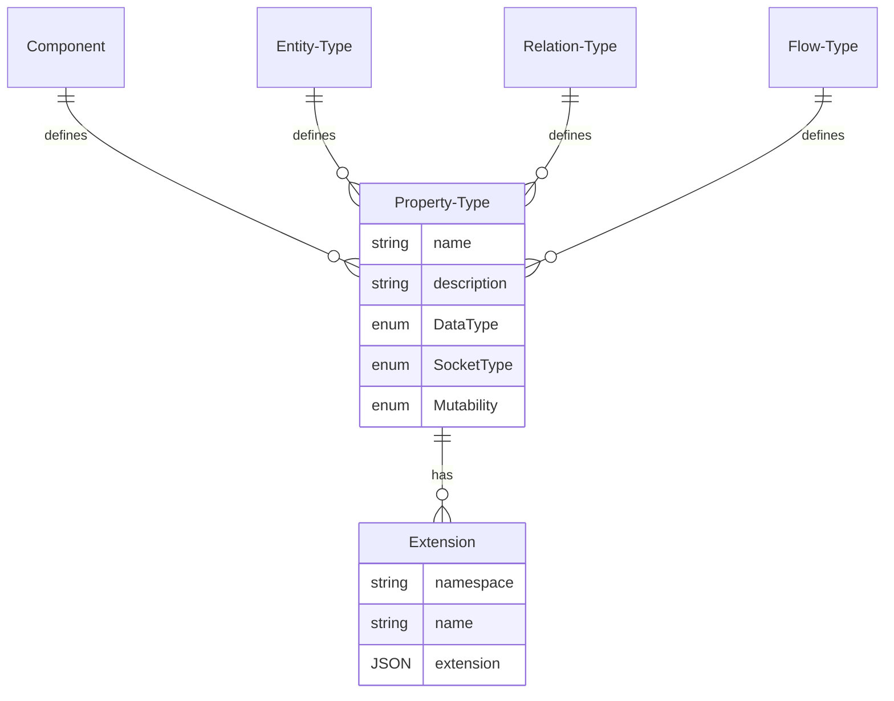

# Model: Property Type

Components, entity types and relation types define which properties they contain. The so-called property types define
the name, the data type and whether the property is an input or an output.

## Data Model

| Field       | DataType                               | Description                                                            | Example                |
|-------------|----------------------------------------|------------------------------------------------------------------------|------------------------|
| Name        | String                                 | The name of the property                                               | name                   |
| Description | String                                 | Textual description of the property                                    | The name of something. |
| DataType    | DataType                               | The data type of the property                                          | string                 |
| SocketType  | SocketType                             | The socket type                                                        | input                  |
| Mutability  | Mutability                             | Defines if the property is mutable or immutable                        | immutable              |
| Extensions  | Vec<[Extension](./Model_Extension.md)> | The extensions contains additional information about the property type |                        |

## ER Diagram

## Enum Data Type

A property has a data type. This is derived from serde_json::Value and maps JSON values or documents.

| Value  | Description                                                 |
|--------|-------------------------------------------------------------|
| Null   | Represents a JSON null value                                | 
| Bool   | Represents a JSON boolean                                   |
| Number | Represents a JSON number, whether integer or floating point |
| String | Represents a JSON string                                    |
| Array  | Represents a JSON array.                                    |
| Object | Represents a JSON object.                                   |
| Any    | Represents any type (relations)                             |

## Enum Socket Type

The socket type determines whether a property serves as an input or an output. It is also possible that a property is
neither an input nor an output. Caution: At runtime, it is not prevented if an input is used as an output or an output
is used as an input.

| Value   | Description                                                          |
|---------|----------------------------------------------------------------------|
| None    | The property doesn't act as input or output socket                   | 
| Input   | The property acts as input socket and accepts incoming connections   |
| Output  | The property acts as output socket and accepts outgoing connections  |

## Enum Mutability

Defines if the property is either mutable or immutable.

| Value     | Description               |
|-----------|---------------------------|
| Mutable   | The property is mutable   |
| Immutable | The property is immutable |

## Where is the value???

A property type only contains the definition of a property, but no data, since it is a type.

When an entity instance or a relation instance is created, the property types are used to create
[property instances](./Model_Property_Instance.md). The property instances then contain a data stream and the last
value.
