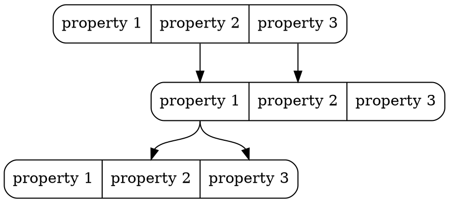
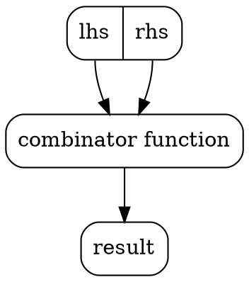

# About `Inexor Reactive Graph Flow`

* Inexor will be a new first-person shooter game which is based on a new octree-based game engine.
* Inexor focuses on classic gameplay as we've seen in Cube2 or the Quake series.
* Inexor will be written from ground up new in C++17 and Rust.
* You can contribute anything you want: code, content, ideas...
* Inexor and all its content is 100% open source!

## What is `Reactive`?

> In computing, reactive programming is a declarative programming paradigm concerned with data streams and the propagation of change.

Data is stored in properties which contains a stream. You can change the data and your data will be sent down the stream.

Remember this basic concept:

1. Every property is a stream not only data
2. Property streams can be subscribed and published
3. The streams of two properties can be connected and changes will be propagated

### Behaviour driven design

A behaviour uses the streams of the property instances, combines them and calculates the
result. Combinators consume one or multiple streams and produces one or multiple streams.

For example the `AND-Gate` accepts inputs at the properties `lhs` and `rhs`. Both streams are
subscribed and zipped. The zipped stream is calculated with a function - in this case the
AND-Operator. This results in another (invisible) stream which is connected with the property
`result`. The entity type `AND-Gate` defines that the properties `lhs`, `rhs` and `result`
have to exist. Furthermore, the socket types are defined: `lhs` and `rhs` are `Input-Socket`s
and `result` is a `Output-Socket`. The behaviour is like the internal wiring of entity
instances and of relation instances. A behaviour can be added to entity instances and removed
from entity/relation instances.

In the Reactive Graph Flow there are `ComponentBehaviour`s, `EntityBehaviours` and
`RelationBehaviours`.

| Type                              | Behaviour                                           |
|-----------------------------------|-----------------------------------------------------|
| Entity Type "and"                 | Entity Behaviour `Logical Gate` with AND-combinator |
| Relation Type "default_connector" | Relation Behaviour `Default Connector`              |

Behaviours are provided by [plugins](./Plugin_System.md).

## What is a `"graph"`?

Internally Inexor RGF is an in-memory graph database with the following properties:

1. Directed Graph (relations points from entity to another entity)
2. Property Graph (each entity and each relation can have properties)
3. Typed (each entity instance is of an entity type and each relation instance is of a relation type)

As first engine of the world Inexor introduces a real graph as foundation of the engine.

The main benefits of a graph are:

* A universal data structure for everything
* Relations are first class citizens
* Benefit from types and instances which makes things intuitive
* Benefit from navigation which is fast and intuitive
* Benefit from the semantics of highly connected, intuitive data
* Properties can store not only certain primitive data but complete documents

## What is a `"flow"`?

Control flows exists in almost any software project. Inexor makes control flows available for game mode
creators and mapmakers to allow new flexibility.

* Connectors connect the properties of entity instances or relation instances
* The control flow logic is based on top of the graph (see above) and reactive programming (see above)
* Flows will contain most of the logic:
  * Game modes will be provided by flows
  * Map logic will be provided by flows
