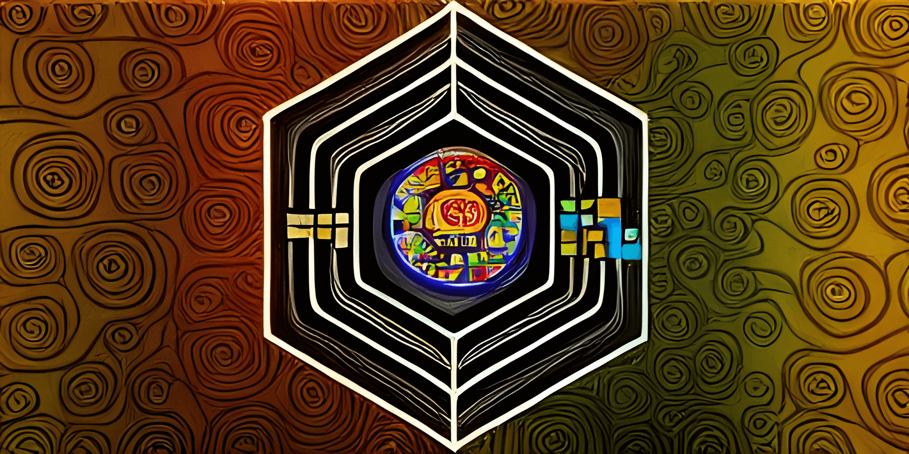

# Design Goals

This chapter describes what the application's design goals are and aren't.

## Plugin System

The plugin system is a central building block and is therefore mentioned first. The goal of the plugin system is to keep
the core as small as possible. The core of the application is described in the next section. Plugins, on the other hand,
contain the functionalities.

The aim of the plugin system is also that you don't have to restart the core application completely just because a small
part has changed. It should be sufficient to restart the modified plugin.

Also, if a plugin stops working, or if the plugin's configuration is changed, restarting the plugin might avoid
restarting the core application.

In addition, the file size of the binary file is reduced since only its libraries are compiled in the core application.

In addition, only what is actually used is loaded. Plugins that are not required for the application can be deactivated.

```admonish info "Quick-Links"
* [Plugins Configuration](./Configuration_Plugins.md)
* [Plugin System](./Plugin_System.md)
* [Building Plugins](./Development_Build.md#build-plugins)
```

## Core Application

The core application consists of a few central building blocks. As already mentioned in the introduction, this includes
a built-in graph database.

Based on this, the type system is managed by the core application. This means that in the business logic layer there is
a management service to edit the type system. With the help of these services, new types can be created, queried,
searched for and deleted.

Furthermore, the instance system is managed. Similar to the type system, new instances can be created, queried, searched
for and deleted.

Reactive instances are managed by the reactive instance system with reactive entity instances, reactive relation
instances and reactive flow instances.

Finally, the two main approaches to the Reactive Graph Flow are provided.

One access to the Reactive Graph Flow is the plugin system, which is granted access to the business logic layer of the
core application via the plugin API. Type system and reactive instance system are available to every (Rust) plugin.

Second access is the GraphQL server, which also provides access to the type system and the reactive instance system.

In addition, there are cross-sectional functionalities such as lifecycle management, logging and configuration.

For configurations, TOML should be used as the configuration format wherever possible.

The application should be able to be adapted to the application by means of configuration.

```admonish info "Quick-Links"
* [GraphQL API](./GraphQL_API.md)
* [Plugin API](./Plugin_System.md)
* [Data Model](./Model.md)
```

## Core Application Non-Goals

This section explains which goals are not pursued in the core application.

* Commands
* Configurations for purposes other than logging, plugins, GraphQL server
* System-Variables
* Meta data
* Implementation of certain reactive behaviors: e.g. logic gates, arithmetic gates
* Implementation of game modes, maps, mods
* Synchronization
* Flow-Editor
* Graphics-Rendering
* Octree-Editor


