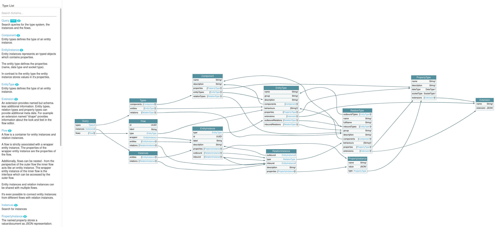

# GraphQL API

GraphQL is the most important interface for interaction with the Reactive Graph Flow.

The GraphQL endpoint can be reached at `http://hostname/31415/graphql` or `ws://hostname/31415/graphql`.

The GraphQL schema is well documented.

## Queries

## Mutations

## Subscriptions

