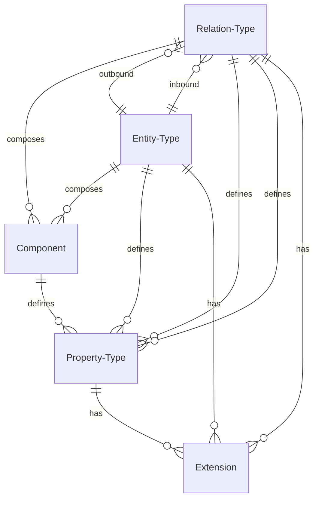
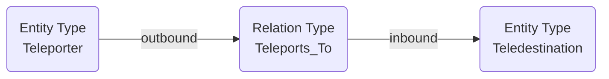
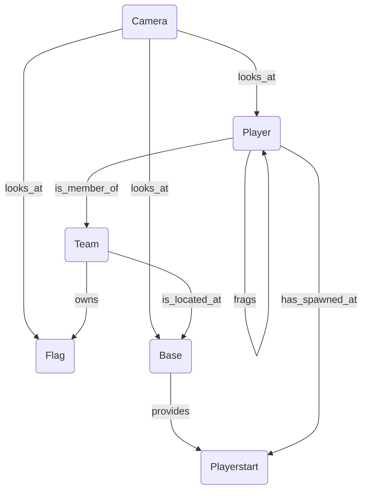
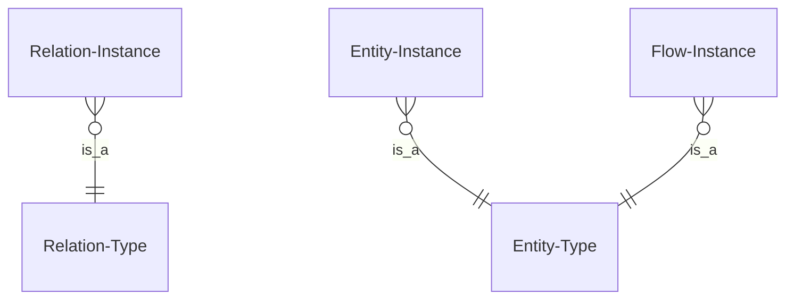
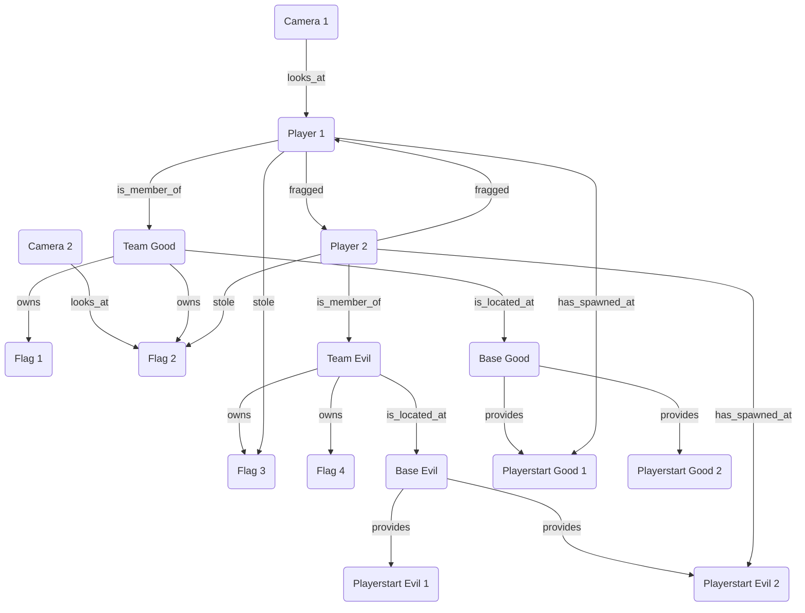

# Model

The data model of Inexor Reactive Graph Flow can be divided into the type system and the instance system.

## Type System

The type system is similar to type systems in programming languages. An object is of a specific, previously defined
type.

The type says something about the semantic meaning. For example, just looking at the type name gives you an idea of what
a "player" or a "camera" is, for example.

The type system also specifies the data model of such a semantic object. For example, a player has a name, is in a
position, and you know how many frags he has scored. Therefore, it is defined that a player should have a property
called "name".

Types are also related to each other. For example, a teleport entrance has one or more teleport exits. This relationship
between the teleport input type and the teleport output type is called a relation type. The relation type also has a
semantic meaning. In this case, the relation type "teleports_to" means that a player who is directly at the teleport
entrance should be teleported to the teleport exit.

Another example is a team that has one player as a member. There is a relation type called "is_member_of" that leads
from the entity type team to the entity type relation. Note the direction of the relation type.

This becomes even more relevant when there can be multiple distinct relationships between two entity types. A player can
be a member of a team and he can be the team captain at the same time. The first type of relationship has already been
described, the second has the name "is_captain_of".

### ER Diagram

### Example: Relation Type

### Example: Relation Types & Entity Types

## Instance System

Having described the type system, this section describes the instance system.

The type system describes what could exist.

A type defines how an instance should look like. An instance itself fills this type with life. There can be any number
of instances of a type. For example, there is the player named "peter" and the player named "penacka". In this case
there are two instances of the same type.

The following table shows that an instance and the corresponding type:

| Type          | Instance          | 
|---------------|-------------------|
| Entity Type   | Entity Instance   |
| Relation Type | Relation Instance |
| Entity Type   | Flow Instance     |

### Example: Relation Instances & Entity Instances

