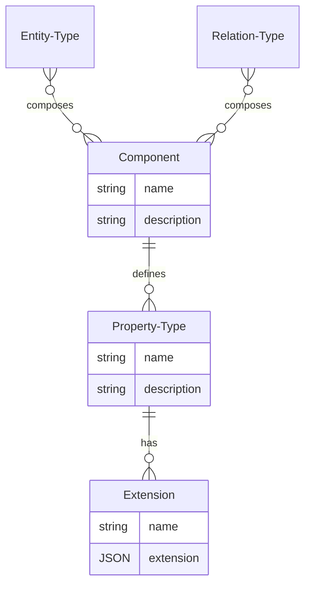

# Model: Component

A component is a reusable building block for entity types and relation types. A component semantically represents an
aspect of one or more entity types or relation types.

For example, the component "named" represents that something has a name. In practice, the component has a property
called "name" which contains the name. The "named" component can be used in a wide variety of cases. For example, a
player has a name, a server has a name, and a player model also has a name. Apart from the name, they have little in
common.

A component should provide at least one property. However, it is also possible to define several properties.

Another example is the "position" component, which defines the x, y, and z coordinates. Again, this is a perfect example
of a Component. Because all things in a 3D world have a position. A player has a position, a camera, a flag or a light
each have a position. But here, too, they have little in common. And yet they have at least one thing in common.

A player has a name and a position, i.e. an entity type (just like a relation type) can consist of several components.
The properties of all components are merged.

## Data Model

| Field       | DataType                                       | Description                                                       | Example                                                                                            |
|-------------|------------------------------------------------|-------------------------------------------------------------------|----------------------------------------------------------------------------------------------------|
| Namespace   | String                                         | The namespace                                                     | core                                                                                               |
| Name        | String                                         | The name of the component                                         | labeled                                                                                            |
| Description | String                                         | Textual description of the component                              | The label is an hierarchical path with static segments, named parameters and catch-all parameters. | 
| Properties  | Vec<[Property Type](./Model_Property_Type.md)> | The properties which are applied on entity or relation instances. |                                                                                                    |
| Extensions  | Vec<[Extension](./Model_Extension.md)>         | A list of extensions which contains additional information        |                                                                                                    |

## ER Diagram



## GraphQL

```admonish tip "GraphQL"
* [GraphQL Queries and Mutations](./GraphQL_API_Components.md)
```
