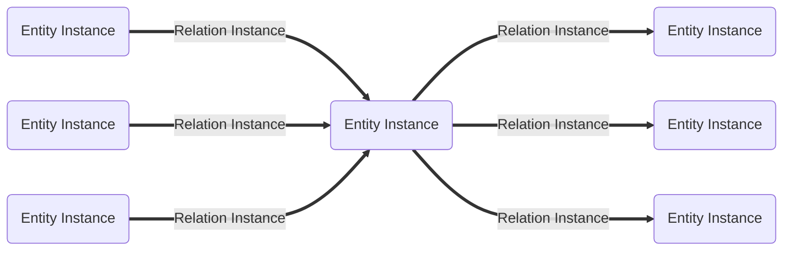
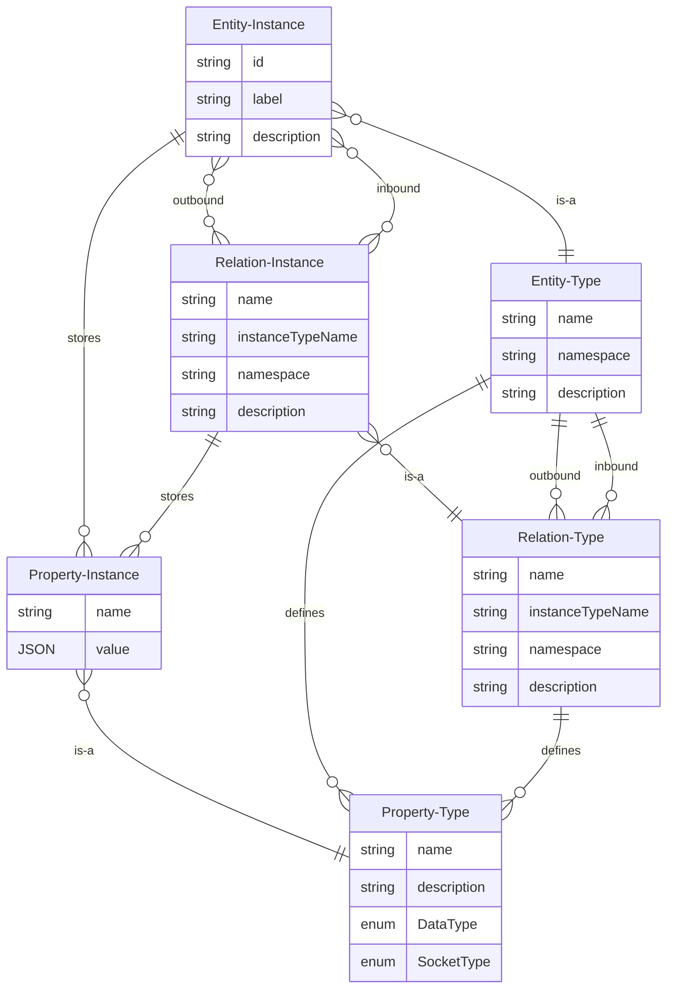

# Model: Entity Instance

An entity instance is an object with characteristics that is of a specific entity type. An entity instance contains a
[property instance](./Model_Property_Instance.md) for each property type defined either in the entity type or in one of
the entity type's components.

In contrast to entity types, property instances are contained and each property instance contains a data stream and its
last value.

## UUIDs

Entity instances can be uniquely identified via a UUID. This is particularly important when entity instances are
synchronized in a distributed system. For example, a player's representation exists not only in the local client, but
also on the server and on clients connected to it.

```admonish info UUIDs
* UUIDs are unique and unique across distributed systems
* UUIDs can be represented as string and as a 128 bit unsigned integer
```


## Labels

Labels are also unique, but optional. While UUIDs are hard to remember, labels are easier to remember. This allows
entity instances to be addressed using labels, for example in GraphQL queries.

If you compare the query with and without a label, you will find that the query is easier to understand thanks to the
label and transports significantly more information about what is actually happening.

```admonish info
Labels are optional
```

```graphql
query {
  instances {
    entities(label: "/org/inexor/input/any_device/key/key_f7") {
      properties(name: "key_down") {
        value
      }
    }
  }
}
```

```graphql
query {
  instances {
    entities(id: "c7ec76e0-40e8-587e-bc89-e9cd31fa75a0") {
      properties(name: "key_down") {
        value
      }
    }
  }
}
```

## Data Model

| Field       | DataType                                               | Description                                  |
|-------------|--------------------------------------------------------|----------------------------------------------|
| Type        | [EntityType](./Model_Entity_Type.md)                   | The type of the entity instance              |
| ID          | UUID                                                   | The unique identifier of the entity instance |
| Label       | String (optional)                                      | The label of the entity instance             |
| Description | String                                                 | Textual description of the entity type       |
| Properties  | Vec<[Property Instance](./Model_Property_Instance.md)> | The properties of the entity instance        |
| Components  | Vec<String>                                            | The currently applied components             |
| Behaviours  | Vec<String>                                            | The currently applied behaviours             |

## Graph



## ER Diagram



## GraphQL

```admonish tip "GraphQL"
* [GraphQL Queries and Mutations](./GraphQL_API_Entity_Instances.md)
```
