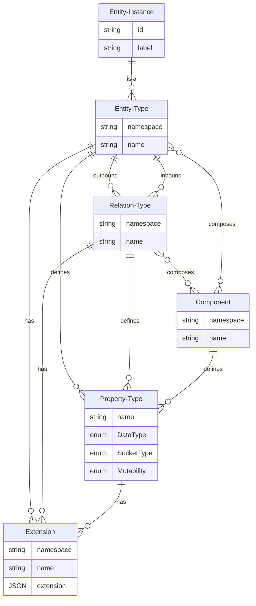

# Model: Entity Type

An entity type defines the characteristics that are common to all entity instances. In particular, an entity type
defines which components it is combined from. Additional properties can also be defined.

## Data Model

| Field       | DataType                                       | Description                                                                         | Example       |
|-------------|------------------------------------------------|-------------------------------------------------------------------------------------|---------------|
| Namespace   | String                                         | The namespace                                                                       | core          |
| Name        | String                                         | The name of the entity type                                                         | player        |
| Description | String                                         | Textual description of the entity type                                              |               |
| Components  | Vec<[Component](./Model_Component.md)>         | The components which composes the entity type. These provides additional properties |               |
| Properties  | Vec<[Property Type](./Model_Property_Type.md)> | The additional properties on entity instances                                       |               |
| Extensions  | Vec<[Extension](./Model_Extension.md)>         | A list of extensions which contains additional information                          |               |

## ER Diagram



## GraphQL

```admonish tip "GraphQL"
* [GraphQL Queries and Mutations](./GraphQL_API_Entity_Types.md)
```

## JSON Schema

```admonish tip "JSON Schema"
http://hostname:port/types/entities/schema
```
