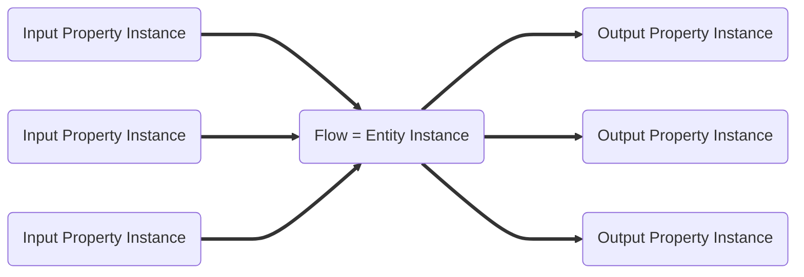
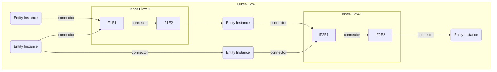

# Model: Flow

## What is a flow?

A flow is a collection of entity instances and relation instances. Most of the time, a flow serves a specific purpose.

## Wrapper Entity Instance

A flow is itself an entity instance. The properties of the entity instance can be viewed as inputs and outputs for the
entire flow. The entity instance which is the flow is called `wrapper entity instance`.



## Nested Flows

Flows are nestable. That is, an entity instance that is itself a flow can be used in another flow. These nested flows
can be thought of as subprograms or sub flows. The input properties of the subflow can be considered as parameters of the
subprogram and the output properties of the subflow can be considered as the function result of the subprogram.

An entity instance can exist in several flows at the same time. For example, a TOML configuration loaded into an entity
instance can be used in multiple flows.

### Nested Flow Example



## GraphQL

```admonish tip "GraphQL"
* [GraphQL Queries and Mutations](./GraphQL_API_Flows.md)
```
