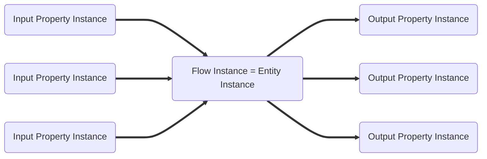
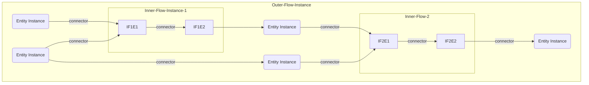

# Model: Flow Instances

## What is a flow instance?

A flow instance is a collection of entity instances and relation instances. Most of the time, a flow instance serves a
specific purpose.

## Wrapper Entity Instance

A flow instance is itself an entity instance. The properties of the entity instance can be viewed as inputs and outputs
for the entire flow instance. The entity instance which is the flow instance is called `wrapper entity instance`.



## Nested Flows

Flow instances are nestable. That is, an entity instance that is itself a flow instance can be used in another flow
instance. These nested flow instances can be thought of as subprograms or sub flows. The input properties of the subflow
can be considered as parameters of the subprogram and the output properties of the subflow can be considered as the
function result of the subprogram.

An entity instance can exist in several flow instances at the same time. For example, a TOML configuration loaded into
an entity instance can be used in multiple flow instances.

### Nested Flow Instance Example



## GraphQL

```admonish tip "GraphQL"
* [GraphQL Queries and Mutations](./GraphQL_API_Flow_Instances.md)
```
