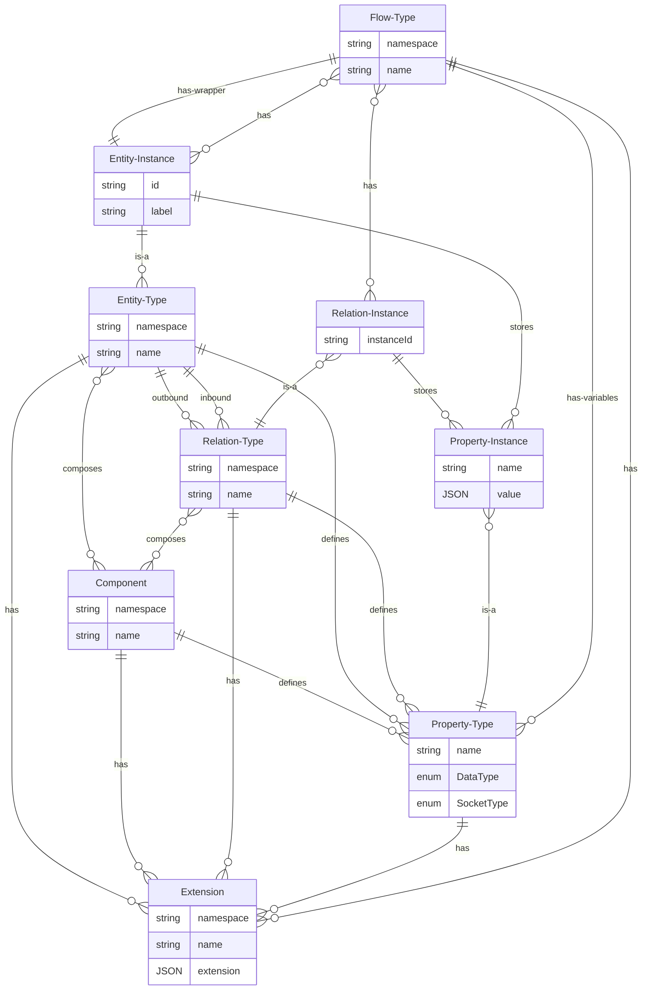

# Model: Flow Type

A flow type consists of entity instances and relation instances. Flow types are not runnable by itself, but you can
create flow instances out of them.

## Wrapper Entity Instance

Flow types can have input and output properties. These are provided by a so-called wrapper-entity-instance. The wrapper
entity instance is the only mandatory entity instance of a flow type.

For the outside view, the **input properties** of the wrapper entity instance are the inputs. Inside the flow the
**input properties** are **output properties** which can be consumed by the entity instances and relation instances
within the flow type.

On the other hand, the **output properties** of the wrapper entity instance are outputs for the outside view. But
inside the flow the **output properties** of the wrapper entity instance are inputs for the entity instances and
relation instances within the flow type.

## Nested Flow Types / Subflows / Subprograms

Nested flow types are possible. The outer flow type contains entity instances and relation
instances which can interact with the wrapper entity instance and their properties of the inner flow type. This way it
is possible to "call" subprograms / subflows / subactivities. The entity instances and relation instances of the inner
flow type are hidden for the outer flow type.

## Data Model

| Field                   | DataType                                               | Description                                                                   | Example                                                   |
|-------------------------|--------------------------------------------------------|-------------------------------------------------------------------------------|-----------------------------------------------------------|
| Namespace               | String                                                 | The namespace                                                                 | logical                                                   |
| Name                    | String                                                 | The name of the flow type                                                     | and3                                                      |
| Description             | String                                                 | Textual description of the flow type                                          | If all three input booleans are true, the output is true. | 
| Wrapper Entity Instance | [Entity Instance](./Model_Entity_Instance.md)          | The wrapper entity instance                                                   |                                                           |
| Entity Instances        | Vec<[Entity Instance](./Model_Entity_Instance.md)>     | The entity instances which are contained in this flow                         |                                                           |
| Relation Instances      | Vec<[Relation Instance](./Model_Relation_Instance.md)> | The relation instances which are contained in this flow                       |                                                           |
| Variables               | Vec<[Property Type](./Model_Property_Type.md)>         | The variables. Variables will be replaced by instantiation of a flow instance |                                                           |
| Extensions              | Vec<[Extension](./Model_Extension.md)>                 | A list of extensions which contains additional information                    |                                                           |

## ER Diagram



## GraphQL

```admonish tip "GraphQL"
* [GraphQL Queries and Mutations](./GraphQL_API_Flow_Types.md)
```
