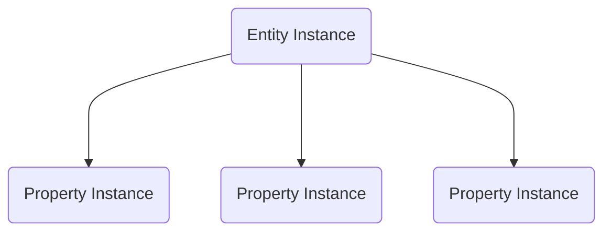
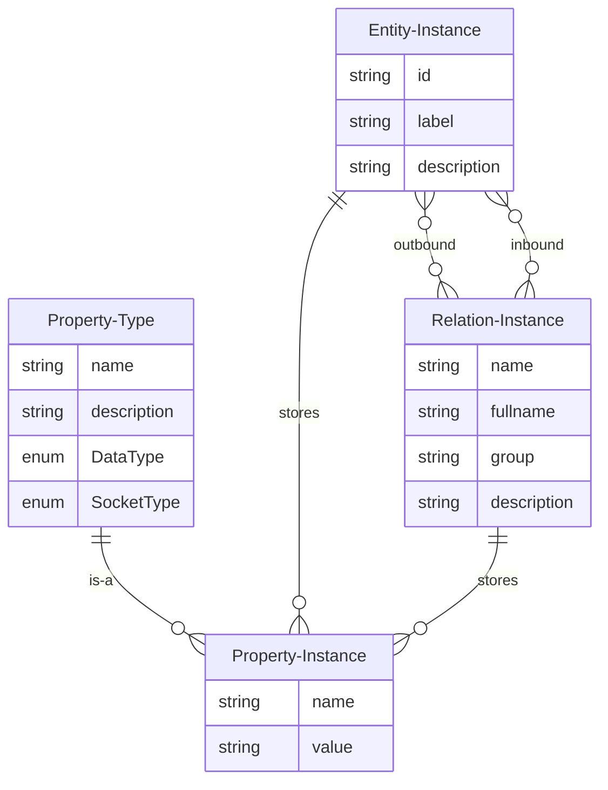

# Model: Property Instance

A property instance is a data stream. The current value of the property instance can be queried. Data streams can be
connected to each other (both within an instance and to data streams from property instances of other entity or relation
instances).

The property type defines the name, data type and socket type of the property instance.

## Data Model

| Field      | DataType                                  | Description               |
|------------|-------------------------------------------|---------------------------|
| Name       | String                                    | The name of the property  |
| Value      | JSON                                      | The value of the property |
| Type       | [Property Type](./Model_Property_Type.md) | The type of the property  |

## Graph

## ER Diagram

