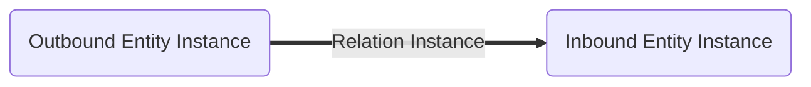
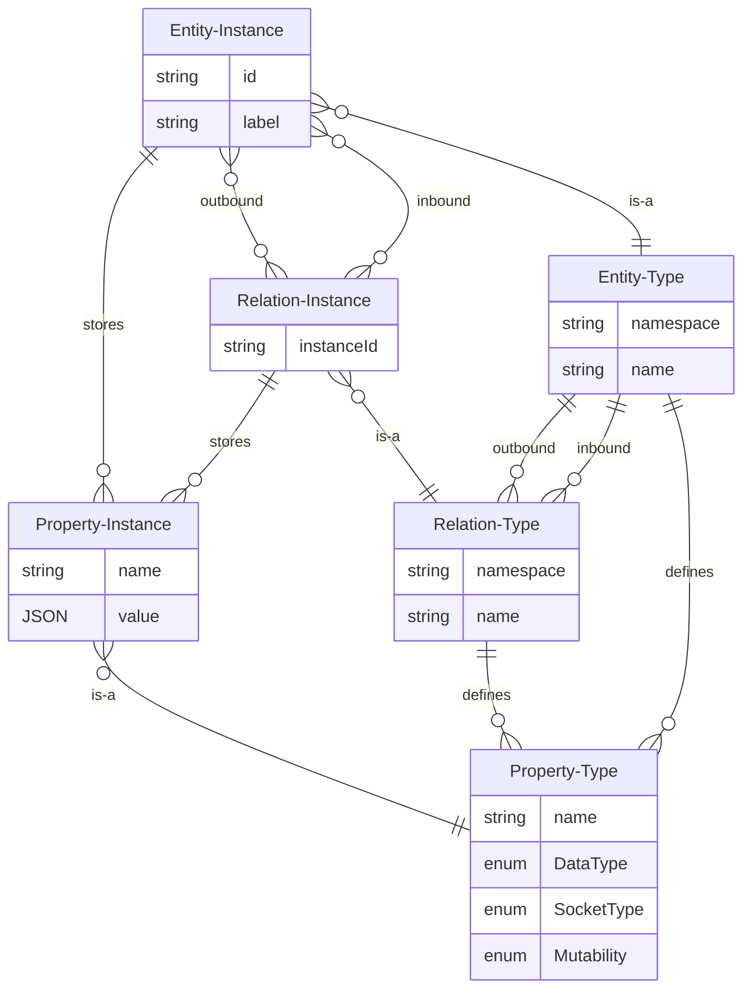

# Model: Relation Instance

A relation instance is a connection between an outbound [entity instance](./Model_Entity_Instance.md) and an inbound
entity instance. The relation instance has a type, the relation type. The [relation type](./Model_Relation_Type.md)
defines which entity type the outbound entity type and which entity type the inbound entity type must have.

## Instance Id / Cardinality

The relation instance is a unique link for the following combination:

* Outbound Entity Instance
* Inbound Entity Instance
* Relation Type
* Instance Id

```admonish warning
It's not possible to add a relation instance with the same outbound, inbound, type and instance_id.
```

There are multiple types of instance ids:

1. Only one instance of the same relation type is allowed between the outbound entity instance and the inbound entity
   instance (Cardinality: 0..1). In this case the instance id is an empty string.
2. The relation instance depends on properties. For example, only one connector can exist between an output
   property of the outbound entity instance and an input property of the inbound entity instance. In this case the
   instance id is a string calculated by the property names of the output property and the input property. This
   will prevent that multiple connectors of the same type exist between the same properties.
3. There is no restriction for a relation instance between the outbound entity instance and the inbound entity
   instance (Cardinality: 0..N). In this case a random string will be generated as instance id. This allows to create
   multiple relation instances of the same type between the same outbound entity instance and inbound entity instance.

```admonish info
The uniqueness of entity instances is much simpler: A simple UUID is sufficient.
```

## Data Model

| Field       | DataType                                               | Description                                  |
|-------------|--------------------------------------------------------|----------------------------------------------|
| Outbound    | [EntityInstance](./Model_Entity_Instance.md)           | The outbound entity instance                 |
| Type        | [RelationType](./Model_Relation_Type.md)               | The relation type                            |
| Instance Id | String                                                 | The instance id                              |
| Inbound     | [EntityInstance](./Model_Entity_Instance.md)           | The inbound entity instance                  |
| Description | String                                                 | Textual description of the relation instance |
| Properties  | Vec<[Property Instance](./Model_Property_Instance.md)> | The properties                               |
| Components  | Vec<String>                                            | The currently applied components             |
| Behaviours  | Vec<String>                                            | The currently applied behaviours             |

## Graph



## ER Diagram



## GraphQL

```admonish tip "GraphQL"
* [GraphQL Queries and Mutations](./GraphQL_API_Relation_Instances.md)
```
