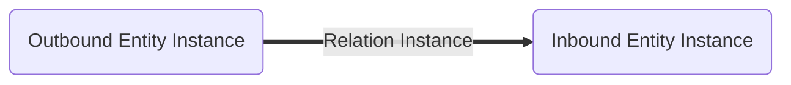
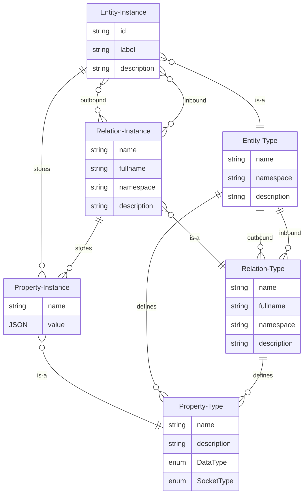

# Model: Relation Instance

A relation instance is a connection between an outbound [entity instance](./Model_Entity_Instance.md) and an inbound
entity instance. The relation instance has a type, the relation type. The [relation type](./Model_Relation_Type.md)
defines which entity type the outbound entity type and which entity type the inbound entity type must have.

## Data Model

| Field       | DataType                                               | Description                                  |
|-------------|--------------------------------------------------------|----------------------------------------------|
| Outbound    | [EntityInstance](./Model_Entity_Instance.md)           | The outbound entity instance                 |
| Type        | [RelationType](./Model_Relation_Type.md)               | The relation type                            |
| Inbound     | [EntityInstance](./Model_Entity_Instance.md)           | The inbound entity instance                  |
| Description | String                                                 | Textual description of the relation instance |
| Properties  | Vec<[Property Instance](./Model_Property_Instance.md)> | The properties                               |
| Components  | Vec<String>                                            | The currently applied components             |
| Behaviours  | Vec<String>                                            | The currently applied behaviours             |

## Graph



## ER Diagram



## GraphQL

```admonish tip "GraphQL"
* [GraphQL Queries and Mutations](./GraphQL_API_Relation_Instances.md)
```
