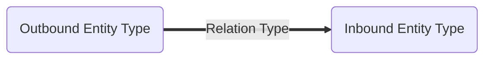
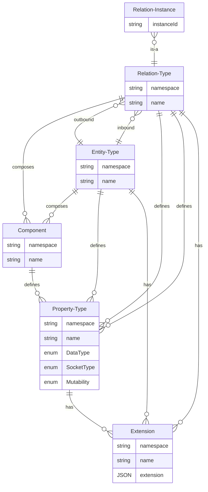

# Model: Relation Type

A relation type defines the characteristics that are common to all relation instances. In particular, a relation type
defines the [entity type](./Model_Entity_Type.md) of the **outbound entity instance** and the entity type of the
**inbound entity instance**.

Like entity types, it is also defined which [components](./Model_Component.md) make up the relation type and which
additional [properties](./Model_Property_Type.md) it contains.

As with entity types, extensions to the relation type can be defined, such as the appearance of edges in a graph or the
appearance of a connector of this type in the flow editor.

## Data Model

| Field         | DataType                                       | Description                                                                           |
|---------------|------------------------------------------------|---------------------------------------------------------------------------------------|
| Outbound Type | [EntityType](./Model_Entity_Type.md)           | The entity type of the outbound entity instance                                       |
| Namespace     | String                                         | The namespace                                                                         |
| Name          | String                                         | The name of the relation type                                                         |
| Inbound Type  | [EntityType](./Model_Entity_Type.md)           | The entity type of the inbound entity instance                                        |
| Description   | String                                         | Textual description of the entity type                                                |
| Components    | Vec<[Component](./Model_Component.md)>         | The components which composes the relation type. These provides additional properties |
| Properties    | Vec<[Property Type](./Model_Property_Type.md)> | The additional properties on relation instances                                       |
| Extensions    | Vec<[Extension](./Model_Extension.md)>         | A list of extensions which contains additional information                            |

## Graph



## ER Diagram



## GraphQL

```admonish tip "GraphQL"
* [GraphQL Queries and Mutations](./GraphQL_API_Relation_Types.md)
```
