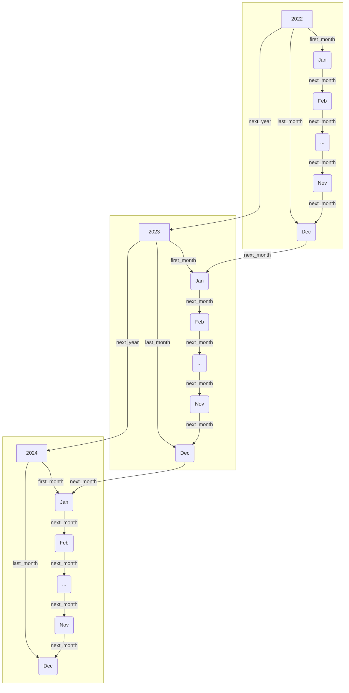

# Time Series

```mermaid
flowchart TB

  subgraph g2024[ ]
    direction TB
    2024
    2024_jan(Jan)
    2024_feb(Feb)
    2024_next(...)
    2024_nov(Nov)
    2024_dec(Dec)
  end

  subgraph m2023[ ]
    direction TB
    2023
    2023_jan(Jan)
    2023_feb(Feb)
    2023_next(...)
    2023_nov(Nov)
    2023_dec(Dec)
  end

  subgraph m2022[ ]
    direction TB
    2022
    2022_jan(Jan)
    2022_feb(Feb)
    2022_next(...)
    2022_nov(Nov)
    2022_dec(Dec)
  end

  2022 -->|next_year| 2023
  2023 -->|next_year| 2024

  2022 -->|first_month| 2022_jan
  2022 -->|last_month| 2022_dec

  2023 -->|first_month| 2023_jan
  2023 -->|last_month| 2023_dec

  2024 -->|first_month| 2024_jan
  2024 -->|last_month| 2024_dec

  2022_jan -->|next_month| 2022_feb
  2022_feb -->|next_month| 2022_next
  2022_next -->|next_month| 2022_nov
  2022_nov -->|next_month| 2022_dec
  2022_dec -->|next_month| 2023_jan
  2023_jan -->|next_month| 2023_feb
  2023_feb -->|next_month| 2023_next
  2023_next -->|next_month| 2023_nov
  2023_nov -->|next_month| 2023_dec
  2023_dec -->|next_month| 2024_jan
  2024_jan -->|next_month| 2024_feb
  2024_feb -->|next_month| 2024_next
  2024_next -->|next_month| 2024_nov
  2024_nov -->|next_month| 2024_dec

```
