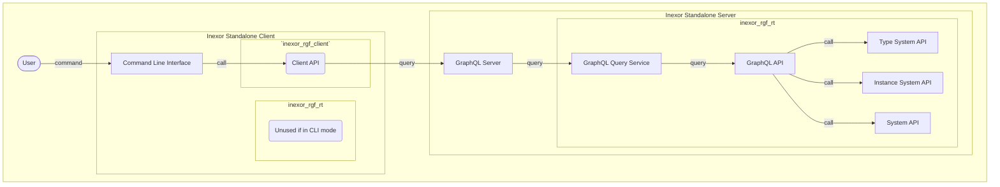
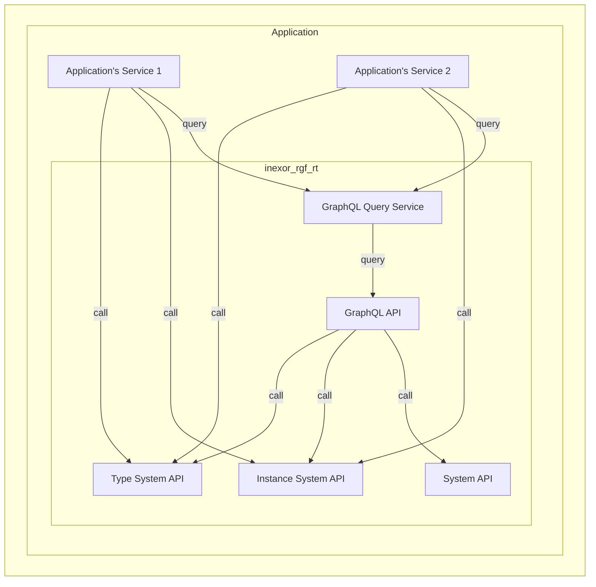
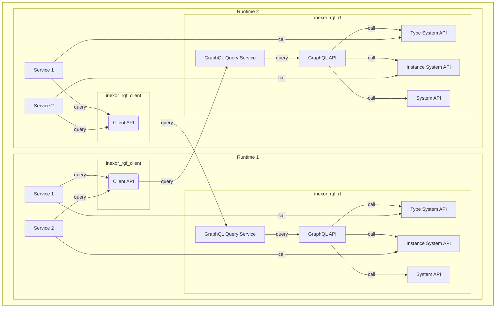
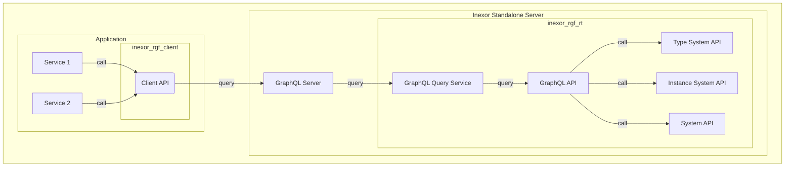

# System Architecture

In this document we describe...

* which components exists
* what they are doing
* how they are used
* and which use cases they fulfill

## Components

First things first: It's important to understand which component is responsible for which task and how they
are connected.

### Inexor RGF Client API `inexor_rgf_client`

The **Client API** (`inexor_rgf_client`) is a rust crate which can be used to communicate with a runtime via it's
GraphQL API. Instead of writing GraphQL queries one just have to call a (rust) method of the **Client API**.

### GraphQL Server `inexor_rgf_rt_standalone`

The **GraphQL Server** is part of the standalone executable. It is integrated in a HTTP webserver and accepts
requests with GraphQL queries and mutations. The GraphQL Server calls the GraphQL Query Service of the runtime.

### GraphQL Query Service `inexor_rgf_rt`

The **GraphQL Query Service** is part of the runtime. It can be used to execute GraphQL queries and mutations. The
GraphQL Query Service uses the GraphQL API.

### GraphQL API `inexor_rgf_rt`

The **GraphQL API** is part of the runtime. The GraphQL API encapsulates calls to the APIs of the Type System API, the
Instance System API and the System API in GraphQL resolvers. It converts internal data structures to and from the types
of the GraphQL schema.

### Type System API `inexor_rgf_rt`

The **Type System API** is part of the runtime. It manages the type system, allows to create, read, update and delete
types of the **reactive graph**. You can manage components, entity types, relation types and flow types.

### Instance System API `inexor_rgf_rt`

The **Instance System API** is part of the runtime. It manages the reactive instances, allows to create, read, update
and delete reactive instances within the **reactive graph**. You can manage entity instances, relation instances
(including flow connectors) and flow instances.

### System API `inexor_rgf_rt`

The **System API** is part of the runtime. It manages commands, plugins, the instance information and remote
instances.

### Command Line Interface API `inexor_rgf_rt_standalone`

The **Command Line Interface API (CLI)** is part of the standalone executable.

It is possible to use the standalone executable as
* **Server** (GraphQL Server + Runtime)
* **Client** (CLI)

The CLI uses the **Client API** to communicate via **GraphQL** with a runtime. You can specify the hostname and port of
the runtime to connect to.

## Use Cases

The components can be used for different use cases:

* Command Line Interface within the standalone executable
* Embed the runtime `inexor-rgf-rt` in your application
* Communicate from one runtime to another
* Let your application communicate with a (remote) runtime
* Integration tests

### Command Line Interface `inexor_rgf_rt_standalone`

The standalone executable can act as CLI. The CLI can connect to any **Inexor GraphQL Server** (local or remote). You
can specify to hostname and port of the GraphQL server to connect to.

### Embedded runtime in an application `inexor-rgf-rt`

Any rust application can embed the Inexor RGF runtime (`inexor-rgf-rt`).

The following diagram shows that the application can:

* Call the **Type System API**, **Instance System API** and **System API** directly via the runtime.
* Execute GraphQL queries or mutations via the **GraphQL Query Service**.

### Communicate from the runtime with another runtime

In order to communicate from one runtime to another runtime you can use the **Inexor RGF Client**
(`inexor_rgf_client`).

In this example two runtimes are calling methods of the own runtime and execute queries on the other runtime via the
**Inexor RGF Client**.

The same applies to two applications which have embedded runtimes.

### Let your application communicate with a (remote) runtime

In order to communicate from your application to a (remote) runtime you can use the **Inexor RGF Client**
(`inexor_rgf_client`).

This example shows the application which uses the **Inexor RGF Client** to execute queries on the (remote) runtime:

## Integration Tests

An integration test verifies the correctness of:

* The **Client API**, because the **Integration Test** calls methods of the **Client API**.
* The **GraphQL API**, because the **Client API** queries the **GraphQL API**.
* The **GraphQL API**, because the **Integration Test** queries the **GraphQL API** of a started runtime directly.
* The APIs of the **runtime**, because the **GraphQL API** calls methods of the **runtime**.
* The APIs of the **runtime**, because the **Integration Test** calls methods of a started **runtime** directly.

```mermaid
graph TD
subgraph Integration Tests[ ]

  IT[Integration Test]
  CA(Client API)
  style IT fill:#333,stroke:#633,stroke-width:4px,margin-top:10px

  subgraph "inexor_rgf_rt"
    GQS[GraphQL Query Service]
    GA[GraphQL API]
    TSA[Type System API]
    ISA[Instance System API]
    SYSA[System API]
  end

  subgraph "inexor_rgf_client"
    CA -->|query| GQS
  end

  IT -->|call| CA
  IT --->|query| GQS
  IT -->|call| TSA
  IT -->|call| ISA

  GQS -->|query| GA
  GA --->|call| TSA
  GA --->|call| ISA
  GA --->|call| SYSA

  IT -->|call| SYSA

end
```

